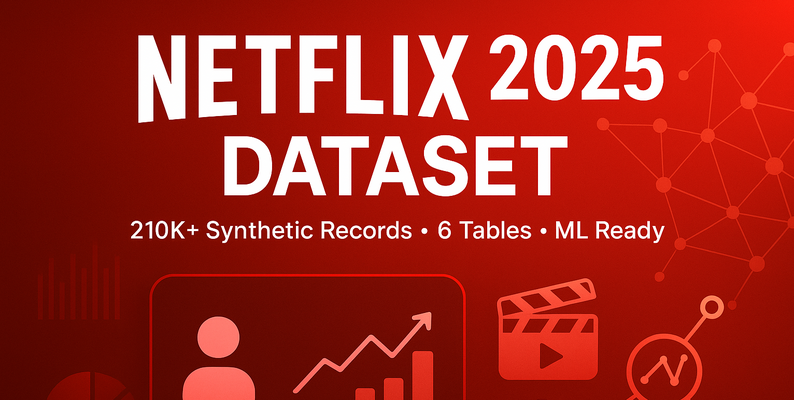

# 🎥 Анализ зрительского поведения на платформе NETFLIX

[Датасет здесь](https://www.kaggle.com/datasets/sayeeduddin/netflix-2025user-behavior-dataset-210k-records)

## Цель: 
провести EDA, проанализировать поведение зрителей, выявить факторы оттока и удержания зрителей на платформе.

---
➡️ [Cам анализ представлен здесь](./netflix-analysis.ipynb)
---

### Особенности датасета и данных

- данные синтетические (со всеми сопутствующими особенностями(;
- датасет разделен на 7 таблиц с внешними ключами;
- есть дубликаты и пропуски, аномальные значения.

### Выдвинутые гипотезы по ходу анализа:

- Доля ушедших зрителей различается в зависимости от типа подписки.
- Существует связь между типом подписки и возрастом пользователя.
- Отток зависит от типа устройства.
- Отток связан с любимым жанром  и типом контента пользователя.
- Средний чек различается в зависимости от пола.

### Выводы и наблюдения:

- Доля ушедших зрителей стабильна и составляет около **15%** вне зависимости от типа подписки. Больше всего зрителей в подписках **26-35** и **36-45**. Наибольший отток наблюдается в группах 15–25 лет и 65–75 лет, но вторая группа малочисленна, поэтому **основной фокус анализа — зрители 15–45 лет**. В каждой возрастной группе отток выше по нецелевым подпискам для каждой группы, что подтверждает важность персонализации предложений.
- Группа **15–25** лет чаще выбирает **подписки Standard и Premium**, при этом отток в этих подписках самый высокий. Сложно сказать, связано ли это с качеством видео на смартфонах или с синтетическим характером данных.
- **Популярность жанра не объясняет отток** (корреляция -0,158). **По типу контента связь слабая** (-0,297), но можно предположить, что в популярных форматах (кино, сериалы) отток ниже. **Устройства показывают умеренно сильную связь** (0,676): чем больше зрителей на устройстве, тем выше отток. **Особое внимание - мобильные устройства**: у них наибольший отток при третьем месте по числу пользователей. Необходимо изучить метрики мобильного приложения.
- **В среднем активные и ушедшие зрители тратят одинаково**. Неожиданно, самый высокий средний чек - у подписки Standard, а не у Premium+. Вероятная причина - **активная покупка подарочных карт**, так как в Netflix даже базовая подписка открывает доступ ко всему контенту, а дополнительные траты возможны только через подарочные карты или добавление пользователей. **Подписка Standard** - лидер по числу зрителей и по чеку, что **требует пересмотра её условий и бонусов**. Premium генерирует значительно меньший чек, и необходимо сделать добавление дополнительных пользователей дешевле или выгоднее.
- **Ушедшие мужчины тратят много в подписках Standard и Premium**, вероятно, не находя обоснования высоким расходам. Возможно, конкуренты предлагают большую ценность за те же деньги. Активные женщины, напротив, более платёжеспособны во всех подписках, особенно в Basic и Premium+, что требует **усиления маркетинга в этих тарифах** для повышения ценности для женщин.
- **Ключевые мужские сегменты** - 15–25, 26–35 и 36–45 лет. В группе 15–25 лет самый популярный контент - **приключенческие и экшен-фильмы**. Необходимо добавить больше качественных фильмов этих жанров, убрать низкорейтинговые и проверить имеющиеся на наличие багов, артефактов и плохого перевода.

### Рекомендации:

- **Пересмотр тарифных планов** _Standard и Premium_ с учётом потребностей мужской аудитории 15-45 лет.
- **Оптимизация мобильного приложения** с целью _снизить отток_ на мобильных устройствах.
- **Пересмотр стратегии в части подарочных карт** - возможно, именно они создают аномально высокий чек в подписке Standard.
- **Таргетированный маркетинг** для женщин в _Basic/Premium+_, для мужчин - в _Standard/Premium_.
- **Анализ и улучшение библиотеки контента** с ориентиром на _Adventure/Action_ для молодёжи.
